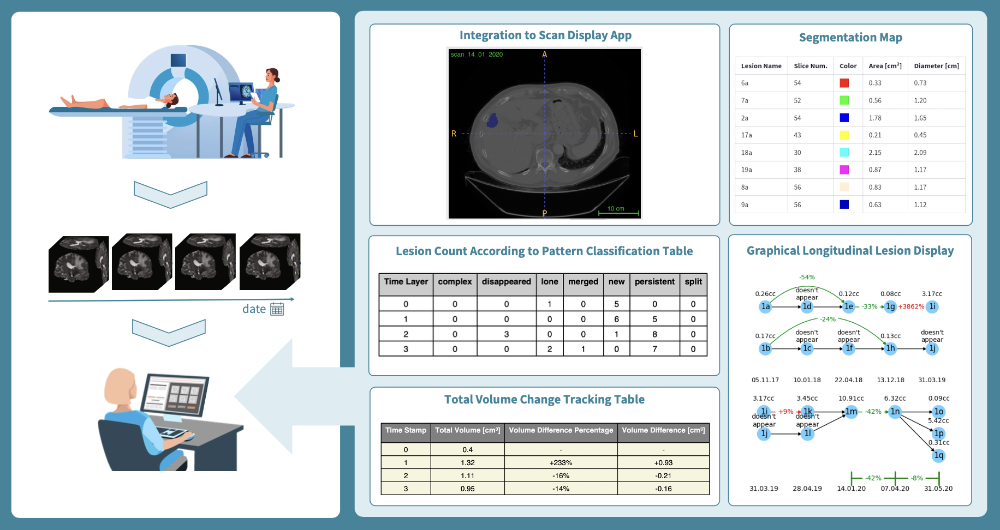

# 💡 Analysis and Summarization of Radiological Findings in Medical Patient Images

<!-- cool project cover image -->


<!-- table of content -->
## Table of Contents
- [The Team](#the-team)
- [Project Description](#project-description)
- [Getting Started](#getting-started)
- [Prerequisites](#prerequisites)
- [Installing](#installing)
- [Testing](#testing)
- [Built With](#built-with)
- [Acknowledgments](#acknowledgments)

## 👥 The Team 
**Team Members**
- [Talia Dym](talia.dym@mail.huji.ac.il)
- [Shira Parker](shira.parker@mail.huji.ac.il)

**Advisor**
- [Alon Olesinski](Alon.olesinski@mail.huji.ac.il)
  
**Supervisor**
- [Leo Joskowicz](https://elsc.huji.ac.il/people-directory/faculty-members/leo-joskowicz/)


## 📚 Project Description
Our project is a program designed to automatically generate a comprehensive summary of a patient's
sequence of scans displayed onto a web app. This program involves collecting lesion data and presenting it clearly. 
We utilize tables, textual summaries, and graphic displays to showcase lesion patterns over time. 
This allows radiologists to gather more precise information in a shorter time frame.

The summary format is interactive, allowing radiologists to customize the displayed information. In addition, 
we generate the summary in a PDF form to support printable summary. 
This design ensures no crucial details are omitted while avoiding overwhelming with extraneous information.
In addition it allows the radiologist to easily open the scans visually (the app integrates with a scan display app).


## ⚡ Getting Started

These instructions will give you a copy of the project up and running on
your local machine for development and testing purposes. 

### 🧱 Prerequisites
Requirements for the software and other tools to build, test and push:

1. Verify that you have ITK-snap app installed on your PC and that it is in the system PATH
    ```bash   
    which itksnap
    ```
    If it doesn't exist on your PC [download ITK-snap app](http://www.itksnap.org/pmwiki/pmwiki.php?n=Downloads.SNAP4)

2. Activate the virtual environment:
    ```bash
    source ./env/bin/activate
    ```

4. Install requirements from requirements.txt:
    ```bash
    pip install -r requirements.txt
    ```
5. [download the DATASET folder](https://drive.google.com/drive/folders/1_WcZRCpbl7htg7E8vAInMXI5c_MQXr2T?usp=share_link) and place it under Engineering_Project (the project root).
   
   NOTICE: this dataset only includes a few patients due to heavy data. The complete dataset is property of the CASMIP lab and is stored in their sources.

### 🏗️ Run The Program
1. Activate the virtual environment:
    ```bash
    source ./env/bin/activate
    ```
2. Run the app
   ```bash
    streamlit run app.py -- --patient_name <patient name> --organ_type <organ type>
    ```
   The dataset you downloaded contains the following patients:
   - patient name: 'C_A_'    organ type: 'liver' 
   - patient name: 'A_S_S_'  organ type: 'liver'
   - patient name: 'A_S_H_'  organ type: 'liver'

## 🧪 Testing
The tests verify that:
- All the elements representing the data were successfully generated with no exceptions.
- The web app is built successfully: it simulates a user and checks all buttons work as expected.

To run tests for this project:
   ```bash
    
   ```


## ⚙️ Built With
Based on methods developed at CASMIP lab:
  - [Liver lesion changes analysis in longitudinal CECT scans by simultaneous deep learning voxel classification with SimU-Net](https://www.sciencedirect.com/science/article/abs/pii/S1361841522003036)
  - [A Graph-Theoretic Approach for Analysis of Lesion Changes and
Lesions Detection Review in Longitudinal Oncological Imaging](https://www.google.com/url?sa=i&url=https%3A%2F%2Fconferences.miccai.org%2F2023%2Fpapers%2F309-Paper0455.html&psig=AOvVaw1AI096scwoyjR0sW-JoIAH&ust=1719994311614000&source=images&cd=vfe&opi=89978449&ved=0CAYQrpoMahcKEwioobOh9IeHAxUAAAAAHQAAAAAQBA)


## 🙏 Acknowledgments
  We would like to thank the CASMIP (HUJI) lab for their support and resources throughout this project. 
  Special thanks to our mentor Alon Olesinski and Professor Leo Joskowicz for their essential insights and guidance. 
